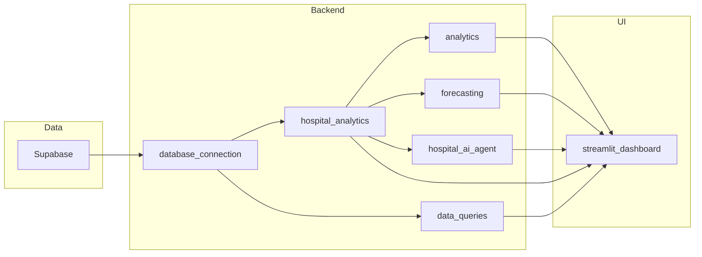
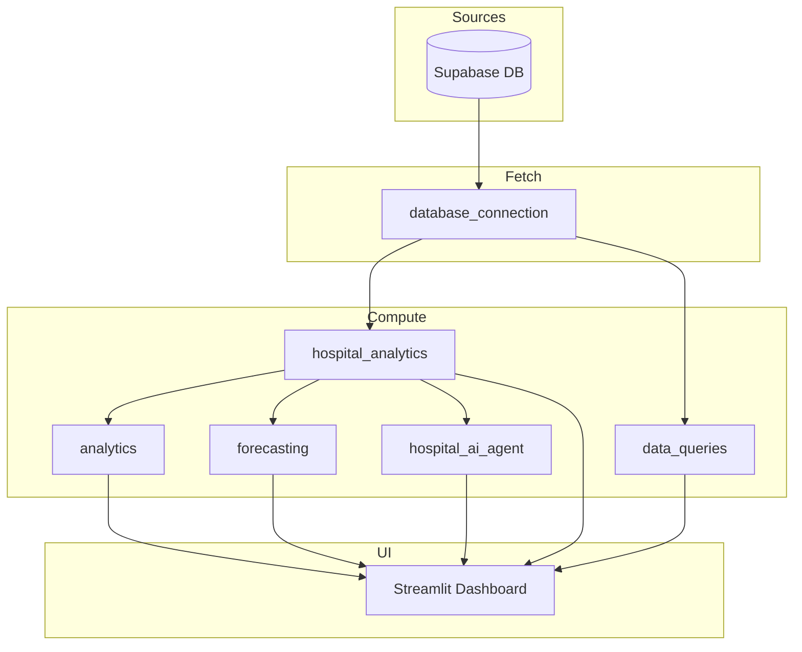
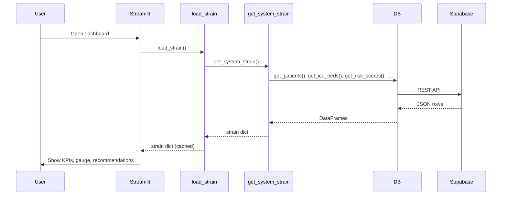
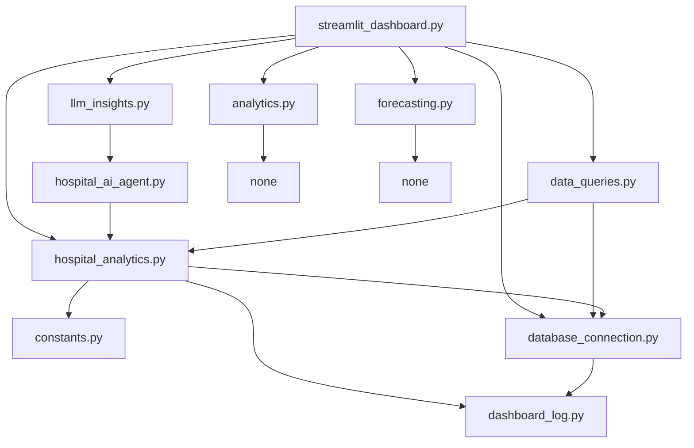
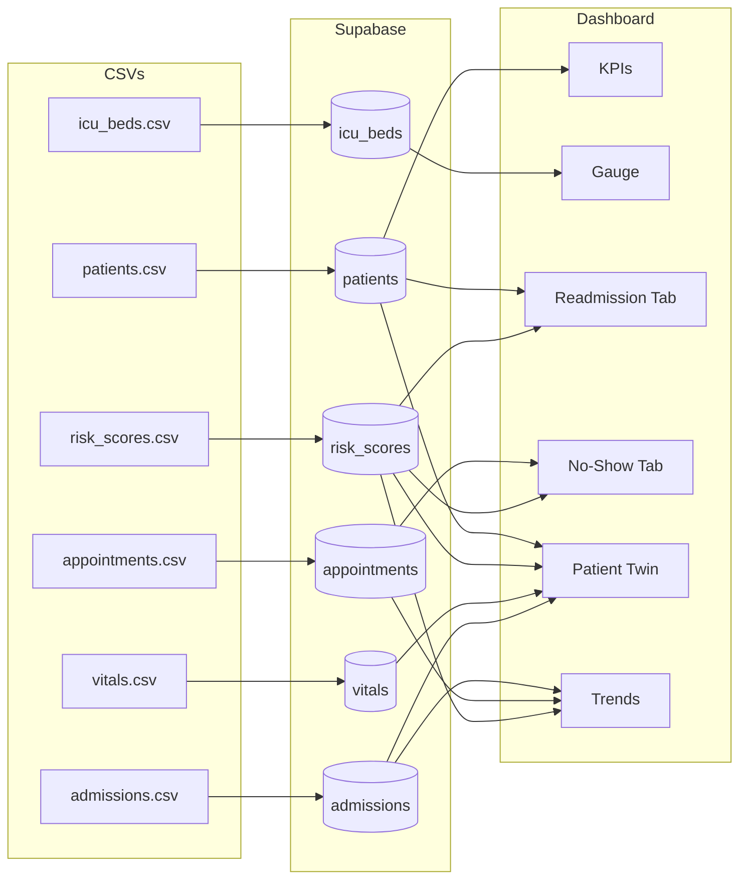

# Hospital Operations Command Center — User & Technical Guide

**Single-document version:** A Word version of this guide is generated as **Hospital_Dashboard_Guide.docx** (same content). To regenerate: `pandoc Hospital_Dashboard_Guide.md -o Hospital_Dashboard_Guide.docx`. Mermaid diagrams appear as code blocks in Word; paste them into [mermaid.live](https://mermaid.live) to view as diagrams.

---

This guide has **three sections**: (1) a clear demonstration of the tool with the test datasets, (2) easy-to-follow documentation of how each function works, and (3) architecture and data flow with diagrams.

---

# Section 1 — Demonstration Using the Test Datasets

This section shows how to run the dashboard with the included test (synthetic) data and what you will see.

## 1.1 What the test dataset is

The **Dataset for Hackathon** folder contains synthetic hospital data:

| File | Rows | Purpose |
|------|------|---------|
| patients.csv | 5,000 | Patient demographics and diagnosis |
| admissions.csv | 12,000 | Inpatient stays (dates, ICU, length of stay) |
| appointments.csv | 10,000 | Outpatient visits (department, no-show) |
| icu_beds.csv | 50 | ICU bed occupancy snapshot |
| risk_scores.csv | 5,000 | Readmission / ICU / no-show risk per patient |
| vitals.csv | 120,000 | Vital signs over time |

No real patient data is used; everything is computer-generated for testing.

## 1.2 Step 1 — Load the data into Supabase

1. In [Supabase](https://app.supabase.com), open your project → **SQL Editor**.
2. Run the script **supabase_schema.sql** (in the project root). This creates the tables.
3. In the project root, create a **.env** file with:
   - `SUPABASE_URL` = your project URL  
   - `SUPABASE_SERVICE_ROLE_KEY` = your API key (Project Settings → API)
4. From a terminal, run the import script:
   ```bash
   cd "Dataset for Hackathon"
   pip install requests python-dotenv
   python import_csv_to_supabase.py
   ```
5. Wait until you see “Done! Data is now in your Supabase database.”

## 1.3 Step 2 — Run the dashboard

```bash
cd hospital_dashboard
pip install -r requirements.txt
streamlit run streamlit_dashboard.py
```

Your browser will open the dashboard. (Optional: set `OPENAI_API_KEY` in `.env` to enable AI tabs.)

## 1.4 What you see — tab by tab

| Tab | What it shows (with test data) |
|-----|---------------------------------|
| **Command Center** | Hospital Strain Score (e.g. 44/100), Total Patients (~5,000), ICU Occupancy (e.g. 80%), High Readmission count, Likely No-Shows. ICU gauge, bed grid (red/green), AI Situation Brief (if API key set), Operational Recommendations, and ICU forecast (12h/24h/48h). |
| **ICU Capacity** | Same ICU gauge and bed grid; 30-day Admissions & Discharges chart from admissions.csv. |
| **Readmission Risk** | Count of high-risk patients (readmission_risk ≥ 0.6); cards per patient with risk %; filters (risk range, department); Top Drivers (diagnosis/department); risk distribution chart. |
| **No-Show Risk** | No-show rate by department (from appointments.csv); list of likely no-show appointments. |
| **Patient Twin** | Dropdown to pick a patient (e.g. P00001); Load Patient Twin shows demographics, vitals chart, risk scores, and AI explanation/insight (if API key set). |
| **Trends** | Line charts: ICU occupancy trend, Readmission risk trend, No-show trend (7 or 30 days); then Admissions & Discharges and Net Flow. |
| **AI Assistant** | Text box to ask questions (e.g. “Who needs attention today?”); answers use only dashboard data (if API key set). |

## 1.5 Quick check that the tool is using the test data

- **Total Patients** should be about 5,000.  
- **ICU** should show about 50 beds with many occupied (red).  
- **Readmission Risk** tab should show hundreds of high-risk patients and risk cards.  
- **Patient Twin** → select any patient (e.g. P00001) → Load Patient Twin: you should see age, diagnosis, risk scores, and vitals if that patient has vitals.

This confirms the dashboard is reading from your Supabase project where you imported the test CSVs.

---

# Section 2 — Documentation: How Each Function Works

This section describes the main functions: **purpose**, **inputs/parameters**, and **return values**. The app is built from the modules below.

## 2.1 Architecture overview



## 2.2 database_connection.py — Data access

Fetches tables from Supabase as pandas DataFrames. No business logic.

| Function | Inputs | Returns | What it does |
|----------|--------|---------|--------------|
| `test_connection()` | None | `bool` | Returns True if Supabase URL and key work. |
| `get_patients()` | None | `DataFrame` | Full patients table (capped). |
| `get_admissions()` | None | `DataFrame` | Full admissions table. |
| `get_appointments()` | None | `DataFrame` | Full appointments table. |
| `get_icu_beds()` | None | `DataFrame` | ICU beds table (up to 500 rows). |
| `get_risk_scores()` | None | `DataFrame` | Risk scores (one row per patient). |
| `get_vitals()` | None | `DataFrame` | All vitals (large). |
| `get_vitals_for_patient(patient_id)` | `patient_id`: string | `DataFrame` | Vitals for one patient only. |

All get_* functions use a shared cache (about 60 seconds) so repeated calls do not hit the API every time.

## 2.3 hospital_analytics.py — Core metrics

Computes everything the dashboard needs from the raw tables.

| Function | Inputs | Returns | What it does |
|----------|--------|---------|--------------|
| `get_data_reference_date()` | None | `Timestamp` | “Today” for the app (latest date in admissions/appointments). |
| `get_total_patients()` | None | `int` | Number of distinct patients. |
| `get_icu_occupancy()` | None | `dict` | `total`, `occupied`, `rate` (0–1), `high_operational_risk`. |
| `get_system_strain()` | None | `dict` | One dict with: icu_rate, readmit_rate, noshow_rate, strain_score (0–100), strain_level, total_patients, icu_total, icu_occupied, high_readmission_count, likely_no_show_count, admissions_trend_records, department_no_show_records, data_as_of. **Call this once per page load for KPIs and AI.** |
| `get_high_readmission_patients(limit)` | `limit`: int (e.g. 100) | `DataFrame` | Patients with readmission_risk ≥ 0.6, sorted by risk, up to `limit` rows. |
| `get_likely_no_shows(days_ahead)` | `days_ahead`: int (default 1) | `DataFrame` | Appointments in next N days likely to no-show (from risk or rules). |
| `get_admissions_trend(days)` | `days`: int (e.g. 30) | `DataFrame` | Columns: date, admissions, discharges (daily counts). |
| `get_department_no_show_rates()` | None | `DataFrame` | Columns: department, total_appointments, no_shows, no_show_rate. |
| `get_patient_id_list(max_ids)` | `max_ids`: int (default 500) | `list[str]` | Sorted patient IDs for dropdowns. |
| `get_patient_history(patient_id)` | `patient_id`: str or int | `dict` | Keys: demographics, risk_scores, vitals, admissions (DataFrames/dicts for one patient). |

## 2.4 data_queries.py — Trend series for charts

| Function | Inputs | Returns | What it does |
|----------|--------|---------|--------------|
| `get_trend_data(metric_name, *, hours_24=False, days_7=True)` | `metric_name`: "icu_occupancy", "readmission_risk", or "no_show". `days_7`: True = last 7 days, False = last 30. | `DataFrame` with columns `date`, `value` | ICU trend = proxy % from admissions/discharges; readmission = daily count of high-risk patients; no_show = daily no-show count. |

## 2.5 analytics.py — Root cause and strain score

| Function | Inputs | Returns | What it does |
|----------|--------|---------|--------------|
| `analyze_readmission_drivers(df)` | `df`: DataFrame of high-risk patients (with diagnosis/department/discharge columns if present) | `dict` with keys: `top_conditions`, `departments`, `discharge_types` — each a list of `{name, count}`. | Finds top diagnoses, departments, and discharge types in the high-risk list. |
| `hospital_strain_score(icu_occupancy_pct, readmission_rate, no_show_rate)` | All three in 0–1 scale (e.g. 0.9 for 90% ICU). | `(score, status)` — score 0–100, status "normal" (0–30), "elevated" (30–60), "critical" (60+). | Formula: 0.5×ICU + 0.3×readmission + 0.2×no_show, then banded. |

## 2.6 forecasting.py — ICU projections

| Function | Inputs | Returns | What it does |
|----------|--------|---------|--------------|
| `predict_icu_load(current_rate, historical_data=None, icu_total_beds=50)` | `current_rate`: 0–100 or 0–1. `historical_data`: optional DataFrame with `date` and `value`. | `dict`: `next_12h`, `next_24h`, `next_48h` (each 0–100). | Simple linear/rolling projection from last 5 days; if no history, uses small drift. |

## 2.7 hospital_ai_agent.py — LLM features

All functions need `OPENAI_API_KEY` or `LLM_API_KEY`; otherwise they return a short “unavailable” message.

| Function | Inputs | Returns | What it does |
|----------|--------|---------|--------------|
| `answer_user_question(question, data_context)` | `question`: string. `data_context`: dict from get_system_strain(). | `str` | Answers using only data_context (no invented numbers). |
| `explain_patient_risk(patient_id, history)` | `patient_id`: str/int. `history`: dict from get_patient_history(). | `str` | Plain-language explanation of that patient’s risk. |
| `generate_operational_recommendations(summary_data)` | `summary_data`: dict with icu_rate, icu_occupied, icu_total, high_readmission_count, likely_no_show_count. | `str` | Three actionable recommendations (action, reason, impact). |
| `generate_situation_brief(summary_data)` | `summary_data`: full strain dict (e.g. get_system_strain()). | `str` | One short executive paragraph (ICU, readmission, no-show, priorities). |
| `patient_digital_twin_insight(patient_id, history)` | Same as explain_patient_risk. | `str` | Readmission probability, risk factors, suggested follow-up. |

## 2.8 streamlit_dashboard.py — UI and cached loaders

The dashboard uses **cached** wrappers (TTL 60 seconds) so data is not re-fetched on every click:

| Function | Inputs | Returns | What it does |
|----------|--------|---------|--------------|
| `load_strain()` | None | strain dict | Calls get_system_strain(); used for navbar and KPIs. |
| `load_readmission(limit)` | `limit`: int | DataFrame | Calls get_high_readmission_patients(limit). |
| `load_trend(days)` | `days`: int | DataFrame | Calls get_admissions_trend(days). |
| `load_trend_data(metric_name, days_7)` | Same as get_trend_data | DataFrame | For ICU / readmission / no-show line charts. |
| `load_patients_table()` | None | DataFrame | Merged patients + risk_scores + icu_status for drill-down lists. |

Entry point is **main()**: it sets page config, session state, loads strain, renders the navbar, strain score banner, sidebar, and either the drill-down view or the seven tabs (Command Center, ICU Capacity, Readmission Risk, No-Show Risk, Patient Twin, Trends, AI Assistant).

---

# Section 3 — Architecture and Data Flow (with Mermaid)

This section gives a simple visual picture of how the tool is built and how data moves.

## 3.1 High-level flow



## 3.2 Data flow for the Command Center tab



## 3.3 Module dependency diagram



## 3.4 Test data → dashboard mapping



---

# Summary

| Section | Content |
|---------|---------|
| **1. Demonstration** | How to load the test datasets into Supabase, run the dashboard, and what each tab shows so you can confirm the tool works with the test data. |
| **2. Documentation** | Function-level reference: purpose, inputs, parameters, and return values for database_connection, hospital_analytics, data_queries, analytics, forecasting, hospital_ai_agent, and streamlit_dashboard. |
| **3. Architecture** | Mermaid diagrams: high-level flow, sequence for Command Center, module dependencies, and mapping from test CSVs to Supabase to dashboard tabs. |

For full variable-level dataset details (codebook), see **Dataset for Hackathon/README.md**. For the complete function reference, see **hospital_dashboard/DOCUMENTATION.md**.
